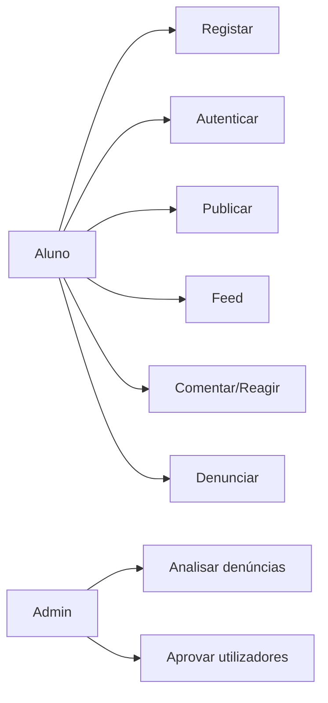

# 03 — Casos de Utilização

## Atores

Aluno · Professor · Administrador · Sistema IA (opcional)

## Diagrama

## Casos resumidos

| ID | Caso | Ator | Resultado |
|----|------|------|-----------|
| CU01 | Obter conta (admin/secretaria) | Aluno | Conta `ATIVO` criada pela escola |
| CU02 | Iniciar sessão | Todos ativos | JWT + acesso ao feed |
| CU03 | Gerir perfil | Autenticado | Dados atualizados |
| CU04 | Criar publicação | Aluno/Prof | Post no feed |
| CU05 | Consultar feed | Autenticado | Lista paginada |
| CU06 | Comentar/reagir | Autenticado | Interação persistida |
| CU07 | Denunciar | Aluno/Prof | Denúncia `ABERTA` |
| CU08 | Moderar | Admin | Conteúdo/conta tratados |
| CU09 | Aprovar registo | Admin | `PENDENTE` → `ATIVO` |
