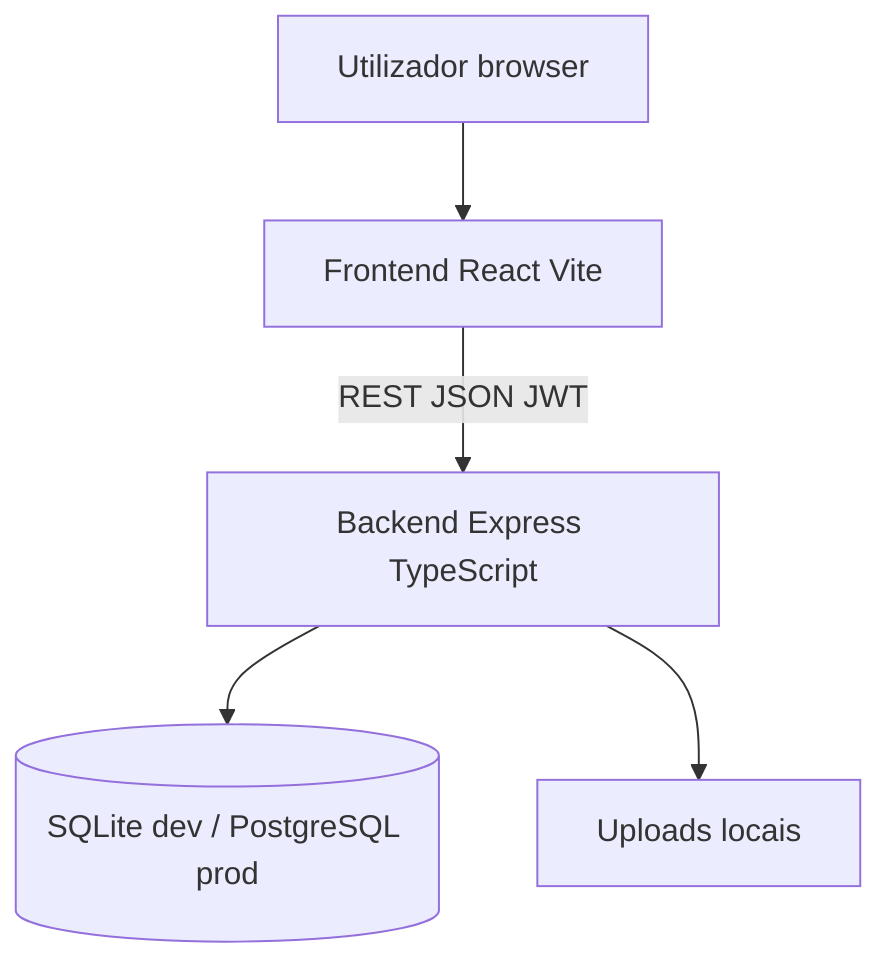

# 04 — Arquitetura

## Diagrama

## Camadas da API

| Camada | Responsabilidade |
|--------|------------------|
| Routes | HTTP, validação Zod |
| Middleware | JWT, RBAC, rate limit login |
| Services | Regras de negócio |
| Prisma | Acesso à base de dados |

## Tecnologias

| Camada | Tecnologia |
|--------|------------|
| Frontend | React 18, TypeScript, Vite, React Router |
| Backend | Node.js, Express, TypeScript, Prisma |
| BD | SQLite (desenvolvimento), PostgreSQL (produção) |
| Auth | JWT + bcrypt |

## Justificação

Stack comum, documentação abundante, adequada a protótipo académico com evolução para produção.

## Segurança

- Domínio email validado no servidor: `epgerabriel.edu.pt`
- Helmet, CORS restrito, `.env` fora do Git
- RBAC por `role` e `status`
- Contas demo fictícias no seed
