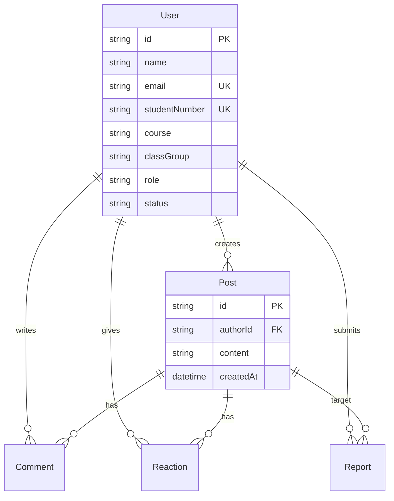

# 05 — Modelo de Dados

## Entidades

- **User** — identidade, perfil, papel, estado da conta
- **Post** — publicação no feed
- **Comment** — comentário num post
- **Reaction** — reação num post (uma por utilizador)
- **Report** — denúncia
- **AuditLog** — ações de moderação

## DER

## Relações

- User 1:N Post, Comment, Reaction, Report
- Post 1:N Comment, Reaction
- Report referencia post ou comentário (targetType + targetId)

Implementação SQL de referência: [`../database/schema.sql`](../database/schema.sql).  
Schema Prisma em `backend/prisma/schema.prisma`.

## Enumerações

- **role:** ALUNO, PROFESSOR, ADMIN
- **status:** PENDENTE, ATIVO, SUSPENSO, BLOQUEADO
- **report.reason:** BULLYING, INSULTO, AMEACA, OFENSIVO, IMPROPRIO, SPAM, OUTRO
